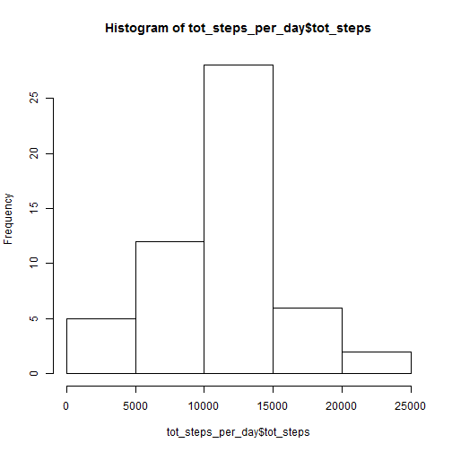

This program will analyze some fitbit data!

# Part 1:  SET UP THE ENVIRONMENT.

We start by setting up our environment.  I will show you the code, but will hide the (not very interesting) results.


```r
localpath <- "C:/Users/bmclaugh/Desktop/Coursera/git/RepRes1/";
setwd(localpath);
# install.packages("doBy");
library("stringr");
library("doBy");
library("ggplot2")
library("plyr");
```


# Part 2:  LOAD THE DATA.

## Part 2a:  Load & coerce the data.
Now, I will read in the data, coerce a few variables, and add in some other fields that will be useful.

Specifically, I'm:
* Coercing the date field to be a legit date
* Creating both Datetime and Time field
* Creating a Day of Week (DOW) field 
* Creating a factor for Weekday vs. Weekend


```r
fitbit <- read.csv("./activity.csv");
fitbit$date <- as.Date(fitbit$date);
fitbit$datetime <- strptime(paste(fitbit$date, str_pad(fitbit$interval,4,pad="0")),"%Y-%m-%d %H%M");
fitbit$time <- strptime(paste("1900-01-01", str_pad(fitbit$interval,4,pad="0")),"%Y-%m-%d %H%M");
fitbit$dow <- weekdays(fitbit$date);
fitbit$weekend <- factor(fitbit$dow %in% c("Saturday","Sunday"));
levels(fitbit$weekend)[levels(fitbit$weekend)=="FALSE"] <- "Weekday";
levels(fitbit$weekend)[levels(fitbit$weekend)=="TRUE"] <- "Weekend";
```

Here are the top 10 rows, to give you a sense for the data:

```r
head(fitbit,10);
```

```
##    steps       date interval            datetime                time
## 1     NA 2012-10-01        0 2012-10-01 00:00:00 1900-01-01 00:00:00
## 2     NA 2012-10-01        5 2012-10-01 00:05:00 1900-01-01 00:05:00
## 3     NA 2012-10-01       10 2012-10-01 00:10:00 1900-01-01 00:10:00
## 4     NA 2012-10-01       15 2012-10-01 00:15:00 1900-01-01 00:15:00
## 5     NA 2012-10-01       20 2012-10-01 00:20:00 1900-01-01 00:20:00
## 6     NA 2012-10-01       25 2012-10-01 00:25:00 1900-01-01 00:25:00
## 7     NA 2012-10-01       30 2012-10-01 00:30:00 1900-01-01 00:30:00
## 8     NA 2012-10-01       35 2012-10-01 00:35:00 1900-01-01 00:35:00
## 9     NA 2012-10-01       40 2012-10-01 00:40:00 1900-01-01 00:40:00
## 10    NA 2012-10-01       45 2012-10-01 00:45:00 1900-01-01 00:45:00
##       dow weekend
## 1  Monday Weekday
## 2  Monday Weekday
## 3  Monday Weekday
## 4  Monday Weekday
## 5  Monday Weekday
## 6  Monday Weekday
## 7  Monday Weekday
## 8  Monday Weekday
## 9  Monday Weekday
## 10 Monday Weekday
```

## Part 2b:  Conduct some aggregations.

Now, we have to do some aggregations that we will require.  Specifically, we need to calculate the 
total steps per day, and the average steps per interval.
Again, I'll spare you the not-interesting results, but will show you the output.

```r
tot_steps_per_day <- summaryBy(steps ~ date, data=fitbit[!is.na(fitbit$steps),], FUN=function(x) { sum(x, na.rm=TRUE)});
avg_steps_per_time <- summaryBy(steps ~ time, data=fitbit[!is.na(fitbit$steps),], FUN=function(x) { mean(x, na.rm=TRUE)});
names(tot_steps_per_day) <- c("date","tot_steps");
names(avg_steps_per_time) <- c("time","avg_steps");
```

Here are the top 10 rows from each -- first the total steps per day, then the average steps per time.

```r
head(tot_steps_per_day,10);
```

```
##          date tot_steps
## 1  2012-10-02       126
## 2  2012-10-03     11352
## 3  2012-10-04     12116
## 4  2012-10-05     13294
## 5  2012-10-06     15420
## 6  2012-10-07     11015
## 7  2012-10-09     12811
## 8  2012-10-10      9900
## 9  2012-10-11     10304
## 10 2012-10-12     17382
```

```r
head(avg_steps_per_time,10);
```

```
##                   time avg_steps
## 1  1900-01-01 00:00:00 1.7169811
## 2  1900-01-01 00:05:00 0.3396226
## 3  1900-01-01 00:10:00 0.1320755
## 4  1900-01-01 00:15:00 0.1509434
## 5  1900-01-01 00:20:00 0.0754717
## 6  1900-01-01 00:25:00 2.0943396
## 7  1900-01-01 00:30:00 0.5283019
## 8  1900-01-01 00:35:00 0.8679245
## 9  1900-01-01 00:40:00 0.0000000
## 10 1900-01-01 00:45:00 1.4716981
```

## Part 2c:  Fill in the NA Steps.
We will also need to do some analysis on the data with all NA Step values sensibly filled-in.  This
code fills in each blank with the average value for that interval (using the averages we just calculated). Rather than overwrite the NA values, I'm creating a new value: Step2.


```r
fitbit$step2 <- -1;

for(i in 1:length(fitbit[,1])) { 
  if(is.na(fitbit[i,1]) == TRUE) { fitbit[i,8] = avg_steps_per_time[avg_steps_per_time$time == fitbit[i,5],2]; }
                    else { fitbit[i,8] = fitbit[i,1]; }
}
```


## Part 2d:  Do some more aggregations (on the now-filed-in-NA data).
Our final step in processing the data is to calculate some aggregations on the now-filled-in data (the same
total steps per day and average steps per time) -- but also to break out the average steps by weekday and 
weekend.


```r
tot_steps_per_day_comp <- summaryBy(step2 ~ date, data=fitbit, FUN=function(x) { sum(x, na.rm=TRUE)});
avg_steps_per_time_comp <- summaryBy(step2 ~ time, data=fitbit, FUN=function(x) { mean(x, na.rm=TRUE)});
avg_steps_per_time_weekend <- summaryBy(step2 ~ time, data=fitbit[fitbit$weekend=="Weekend",], FUN=function(x) { mean(x, na.rm=TRUE)});
avg_steps_per_time_weekday <- summaryBy(step2 ~ time, data=fitbit[fitbit$weekend=="Weekday",], FUN=function(x) { mean(x, na.rm=TRUE)});

names(tot_steps_per_day_comp) <- c("date","tot_steps");
names(avg_steps_per_time_comp) <- c("time","avg_steps");
names(avg_steps_per_time_weekend) <- c("time","avg_steps");
names(avg_steps_per_time_weekday) <- c("time","avg_steps");
```

# Part 3: ANALYZE THE DATA
Okay, so what does the data tell us?

# Part 3a: Initial Steps-per-Day and Activity-per-Time Analysis
First, let's plot the number of steps taken each day, and calculate the mean and median values for number
of steps taken:


```r
hist(tot_steps_per_day$tot_steps);
```

 

```r
mean(tot_steps_per_day$tot_steps, na.rm=TRUE);
```

```
## [1] 10766.19
```

```r
median(tot_steps_per_day$tot_steps, na.rm=TRUE);
```

```
## [1] 10765
```

Now, let's create a time-series plot of the average steps taken per time period, and calculate when people
are taking the most steps.


```r
plot(avg_steps_per_time$time, avg_steps_per_time$avg_steps, type="l", xlab="Time of Day", ylab="Average Steps Taken", main="Average Steps Per Time");
```

 

```r
avg_steps_per_time[avg_steps_per_time$avg_steps == max(avg_steps_per_time$avg_steps),1];
```

```
## [1] "1900-01-01 08:35:00 EST"
```

Wow, people are prety busy in the morning, at 8:35!

## Part 3B:  Analysis of Steps-per-Day and Activity-per-Time with NAs filled in.
Now, let's see how our mean and median have changed, since we filled in the NA values, and calculate the new
histogram of the number of steps.  


```r
mean(tot_steps_per_day_comp$tot_steps);
```

```
## [1] 10766.19
```

```r
median(tot_steps_per_day_comp$tot_steps);
```

```
## [1] 10766.19
```

```r
hist(tot_steps_per_day_comp$tot_steps, ylim=c(0,40));
```

 

Hm...the mean stayed the same (probably because we replaced it with an average anyway), but the median shifted a bit.  Naturally, the number of total steps went up, since we replaced NA values.

## Part 3C:  Activity-per-Time, Weekdays vs. Weekends!

Finally, let's see how activity varies per time, between weekdays and weekends.

```r
par(mfrow = c(1,2));  
plot(avg_steps_per_time_weekday$time, avg_steps_per_time_weekday$avg_steps,  type="l", xlab="Time of Day", ylab="Average Steps Taken", main="Weekday Activity");
plot(avg_steps_per_time_weekend$time, avg_steps_per_time_weekend$avg_steps,  type="l", xlab="Time of Day", ylab="Average Steps Taken", main="Weekend Activity");
```

 

Ha!  Just as I thought:  We're all scrambling in the mornings on weekdays, but are generally more active on weekends.

